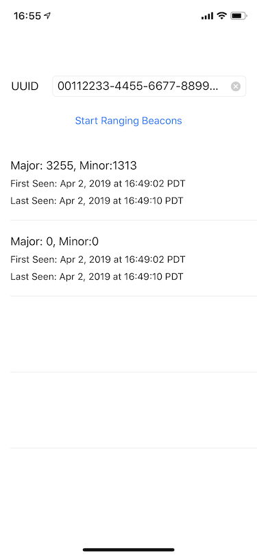

# ranger-ios
Simple iOS app for ranging beacons inside a CLRegion

The app presents a text field for entering a proximity UUID to be used for creating a `CLRegion`. Tapping `Start Ranging Beacons` causes the app to start ranging beacons in the `CLRegion`. Each beacon ranged is displayed as a separate row in the beacon list. The beacon's major and minor values are displayed as well as the time the beacon is first ranged. The last seen time is updated every time the beacon is subsequently ranged.

